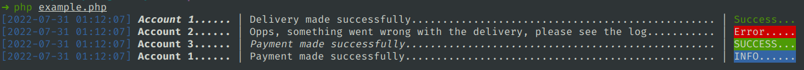
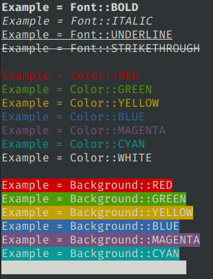

# Console Pretty Print

[](https://github.com/curruwilla/console-pretty-log)
[](https://packagist.org/packages/curruwilla/console-pretty-log)
[](https://github.com/curruwilla/console-pretty-log/releases)
[](LICENSE)
[](https://scrutinizer-ci.com/g/curruwilla/console-pretty-log)
[](https://scrutinizer-ci.com/g/curruwilla/console-pretty-log)
[](https://packagist.org/packages/ccurruwilla/console-pretty-log)

Simple and customizable console log output for CLI apps.

### Highlights

- Simple installation (Instalação simples)
- Very easy to customize text output (Muito fácil de customizar a saída de texto)
- Composer ready and PSR-12 compliant (Pronto para o composer e compatível com PSR-12)

## Installation

Uploader is available via Composer:

```bash
"curruwilla/console-pretty-log": "^1.0"
```

or run

```bash
composer require curruwilla/console-pretty-log
```

## Documentation

Check the example file.

**Example:**
```php
$line = new Line();
$line->columnsSize([15, 75, 10]); // <-- Use to keep information aligned
//$line->separator('-'); <-- Default value: '|'
//$line->paddingCharacter(' '); <-- Default value: '.'
//$line->enableDate(false); <-- Default value: true
//$line->dateFormat("d/m/Y H:i"); <-- Default value: 'Y-m-d H:i:s'

$line
    ->text('Account 1', [Font::BOLD, Font::ITALIC])
    ->text('Delivery made successfully', [Color::WHITE])
    ->text('Success', [Color::GREEN])
    ->print();

$line
    ->text('Account 2', [Font::BOLD])
    ->text('Opps, something went wrong with the delivery, please see the log', [Color::WHITE])
    ->text('Error', [Background::RED])
    ->print();

$line
    ->text('Account 3', [Font::BOLD])
    ->text('Payment made successfully', [Color::WHITE, Font::ITALIC])
    ->text('SUCCESS', [Background::GREEN])
    ->print();

$line
    ->text('Account 1', [Font::BOLD])
    ->text('Payment made successfully', [Color::WHITE])
    ->text('INFO', [Background::BLUE])
    ->print();
```

**Result in CLI:**



**Enums Options:**



## Contributing

Please see [CONTRIBUTING](https://github.com/curruwilla/console-pretty-log/blob/master/CONTRIBUTING.md) for details.

## License

The MIT License (MIT). Please see [License File](https://github.com/curruwilla/console-pretty-log/blob/master/LICENSE) for more information.